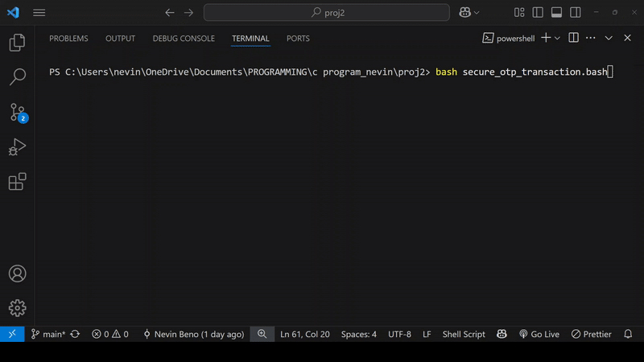

# **Secure OTP Transaction System (BASH)**
 [](LICENSE) 

A **realistic OTP (One-Time Password) validation simulator** with <u>phone number verification</u>, <u>countdown timers</u>, and <u>transaction processing animations</u> - **built purely in Bash**.
___

## **Demo**


A secure, real-time simulation of bank-grade authentication 🔒:<br>
<br>

____
## **Features**
### 🔐 Security
- **TRAI-compliant validation**: Ensures Indian numbers start with `6/7/8/9`.
- **Hidden OTP input**: Uses `-s` flag to prevent shoulder-surfing.
- **Fraud detection**: 20-second lockout after invalid attempts.

### ⚡ UX/UI
- **Visual countdown timer**: Real-time updates with color coding.
- **Animated processing**: Simulates bank transaction flows.
- **Dynamic terminal output**: Clean text overwriting (`\r`).

### 🔧 Configurability
- Adjustable OTP expiry time (`time_set` variable).
- Color customization via ANSI codes.
___
## **USAGE**
## **Requirements**
- **Terminals**: Bash-compatible (Linux/macOS/WSL/Git Bash)  .
- **Editor**: [VS Code](https://code.visualstudio.com/) (optional but recommended)  .

### **Method 1: Terminal**
```bash
# Clone repository (if applicable)
git clone https://github.com/nevinbeno/Secure-OTP-Transaction.git
cd Secure-OTP-Transaction

# Make executable and run
chmod +x secure_otp_transaction.bash
./secure_otp_transaction.bash
```
### **Method 2: Using Visual Studio Code (Alternative Way)**
 1. **Save as :** `secure_otp_transaction.bash`.
2. **Open integrated terminal**

3. **Execute with Bash :**
```bash
bash secure_otp_transaction.bash
```
___
## **Technical Implementation**
| Component                  | Technology Used          |
|:--------------------------:|:------------------------:|
| Phone Validation           | Regex `^[6-9][0-9]{9}$`  |
| Background Timer           | Subshells `() &`         |
| Process Termination        | `kill -9 $$` signal      |
| UI/UX                      |  ANSI color codes, `\r`  |
___
## Quick Start
```bash
bash <(curl -s https://raw.githubusercontent.com/nevinbeno/Secure-OTP-Transaction/main/secure_otp_transaction.bash)
```
----
## **Test Suits | Validation Engine**
**Enterprise - grade testing** for all authentication components.
### 🚀 **Quick Test**
```bash
#Run all tests (from project root)
bash run_tests.bash
```
### 📊 **Test Matrix**
|**Test File**        | **Validates** | **Key Checks** | **Status** |
|:-------------------:|:---------------:|:--------------:|:----------------:|
|`test_Phone_Number_Validation.bash`|Indian Mobile Numbers|TRAI compliance, regex edge cases||
|`test_OTP_generation.bash`|	4-digit OTPs|Randomness, range (1000-9999)||
|`test_transactionFlow.bash`|	OTP matching|Success/failure paths, empty input||
|`test_timeoutHandling.bash`|   5s timeout|No-input/partial-input scenarios||